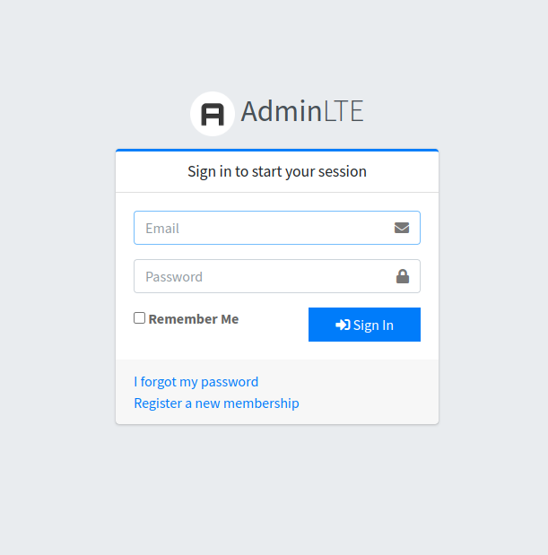
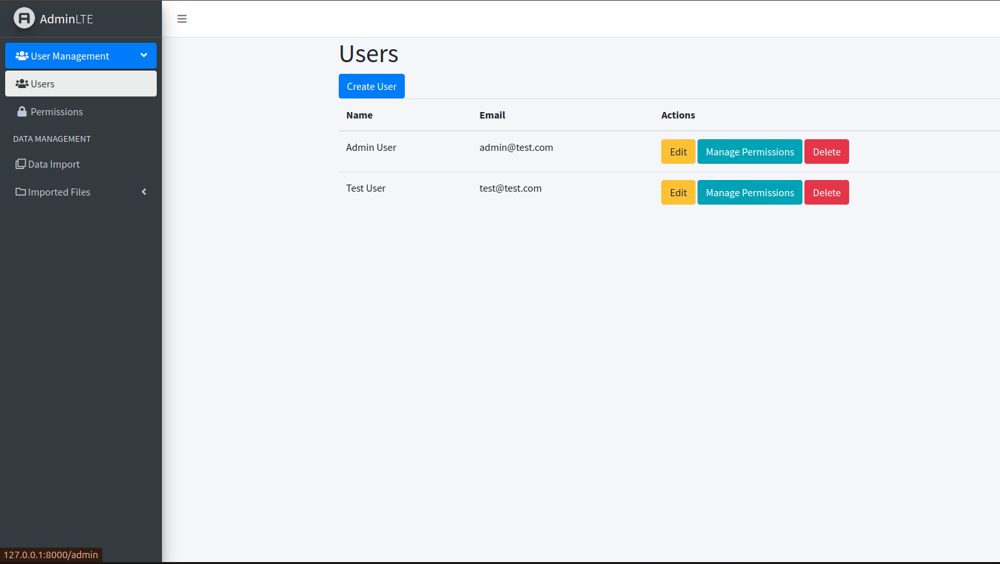
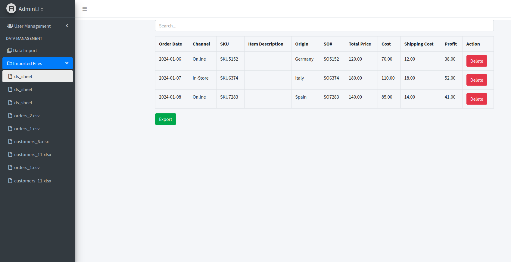
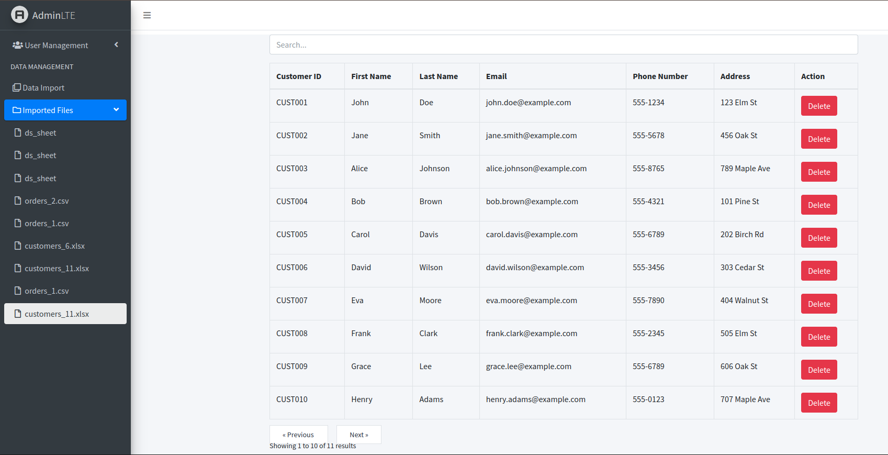
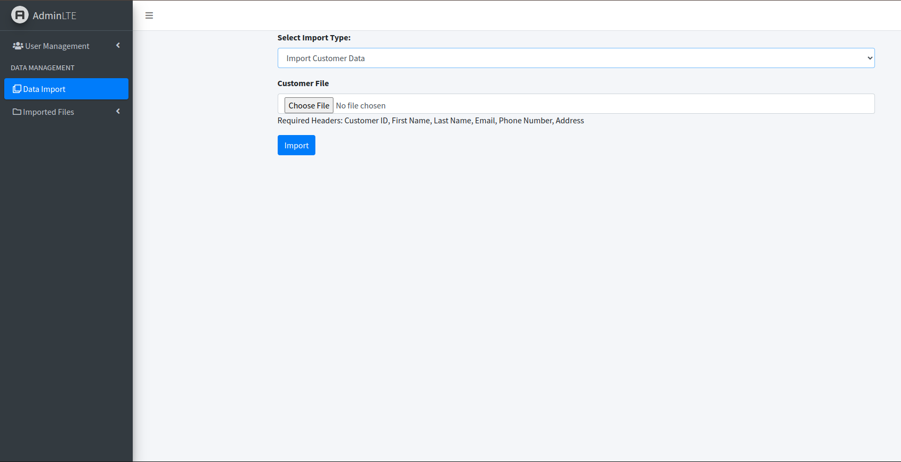

# Laravel 11 Project

## Description

This project is built using Laravel 11, MySQL for the database, and AdminLTE for the frontend UI. It also utilizes popular packages like Spatie for permissions and Laravel Excel for data export.

## Installation

Follow the steps below to set up the project:

1. **Clone the repository:**
   ```bash
   git clone https://github.com/yourusername/your-repository.git
   cd your-repository
    ```
2. **Copy the .env.example file to .env:**
   ```bash
   cp .env.example .env
   ```
   Update the .env file with your database credentials and other necessary configurations.

3. **Install the composer packages:**
    ```bash
   composer install
    ```
4. **Run the migrations:**
    ```bash 
   php artisan migrate
    ```
5. **Seed the database:**
    ```bash
   php artisan db:seed
    ```
   This will create the necessary permissions and roles, and two test users with credentials can be found in the UsersSeeder class.

## Usage
After completing the installation steps, you can start the Laravel development server:
```bash 
php artisan serve
```

## Features
* User Authentication: Basic user authentication using Laravel's built-in features expanded for CRUD. \
* Role and Permission Management: Managed using the Spatie Laravel Permission package. \
* AdminLTE: A fully responsive admin template for the frontend UI. \
* Data Export: Export data to Excel files using the Laravel Excel package.

## Test Users
Two test users are created during the seeding process. Their credentials can be found in the UsersSeeder class.

## Screenshots






